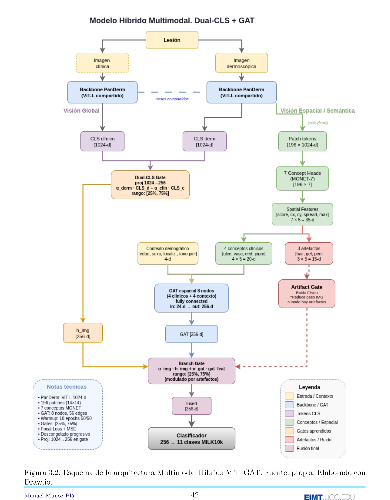

# Pipeline v1.9 — ViT–GAT 8 nodos + DualCLSGate + BranchGate + Focal Loss

**Clasificación multimodal de lesiones cutáneas con Graph Attention Networks y supervisión conceptual.**

Sistema híbrido que combina los Vision Transformers preentrenados en dermatología
(PanDerm ViT-L/16) con una rama relacional GAT de 8 nodos (4 clínicos + 4 contexto
demográfico). La fusión se realiza en dos etapas —`DualCLSGate` para combinar las
modalidades clínica y dermatoscópica, y `BranchGate` para equilibrar visión
global y razonamiento relacional— entrenadas con **Focal Loss (γ = 1.5)** y una
pérdida auxiliar MSE sobre 7 Concept Heads MONET. Es el **modelo ganador del
TFM** (posición 15/50 en el leaderboard ISIC MILK10k 2025).

---

## Resultados

### Métricas OOF (5-fold CV)

| Métrica | Valor |
|---------|-------|
| **F1 Macro** | **0.5411** |
| Balanced Accuracy | 0.5192 |
| Accuracy global | 0.7600 |
| F1 Weighted | 0.7537 |
| Precision Macro | 0.5825 |
| Recall Macro | 0.5192 |
| Cohen's Kappa | 0.6595 |
| MCC | 0.6606 |
| AUC Macro (OvR) | 0.8883 |
| Top-2 Accuracy | 0.8954 |
| Top-3 Accuracy | 0.9431 |

κ y MCC indican "concordancia sustancial" (Landis & Koch).

### Leaderboard ISIC MILK10k 2025

| Config | TTA | T_SOFT | LB F1 | LB BA |
|--------|-----|--------|-------|-------|
| baseline | 1 | 1.0 | 0.467 | 0.475 |
| tta8 | 8 | 1.0 | 0.474 | 0.483 |
| **tta8_t010** | **8** | **0.10** | **0.478** | **0.486** |

Gap OOF↔LB: **−0.063 (11.7 %)** — el más bajo entre todas las versiones evaluadas.

### Estabilidad entre pliegues

| Fold | F1 Macro | Época óptima |
|------|----------|--------------|
| 0 | 0.5612 | 36 |
| 1 | 0.5518 | 22 |
| 2 | 0.5417 | 14 |
| 3 | 0.5340 | 18 |
| 4 | 0.5597 | 24 |
| **Media ± Std** | **0.5497 ± 0.0117** | — |

---

## Arquitectura del Pipeline



---

## Estructura del Pipeline

El pipeline v1.9 se organiza en **4 etapas principales** más la ejecución
cronometrada por fold:

| Etapa | Nombre | Descripción |
|-------|--------|-------------|
| 0 | Configuración | Semillas, device, paths, diccionario `CFG` v1.9 |
| 1 | Preprocesamiento | Carga MILK10k, emparejamiento clin+derm por `lesion_id`, folds |
| 2 | Aumento D4 paralelo | 8 transformaciones dihedrales + pre-cómputo en disco |
| 3 | Entrenamiento + Submission | Loop 5-fold + inferencia TTA + calibración T |

---

## Etapa 0 — Configuración

**Propósito**: Semillas globales, device, constantes de clases y configuración de
hiperparámetros del modelo v1.9.

### Constantes principales

| Constante | Valor | Descripción |
|-----------|-------|-------------|
| `SEED` | 2025 | Semilla global |
| `DEVICE` | cuda/cpu | Dispositivo de cómputo |
| `N_CLASSES` | 11 | Clases MILK10k |
| `MILK10K_CLASSES` | list[str] | AKIEC, BCC, BEN_OTH, BKL, DF, INF, MAL_OTH, MEL, NV, SCCKA, VASC |
| `CLASS_TO_IDX` | dict | Mapeo clase → índice |
| `IDX_TO_CLASS` | dict | Mapeo índice → clase |

### Diccionario `CFG`

```python
CFG: dict = {

    # DATOS E IMÁGENES
    "FOLDS": 5,
    "IMG_SIZE": 224,
    "MEAN": (0.485, 0.456, 0.406),
    "STD":  (0.229, 0.224, 0.225),

    # DATALOADER
    "BATCH_SIZE": 128,
    "NUM_WORKERS": 8,
    "PIN_MEMORY": True,

    # AUMENTACIÓN (grupo dihedral D4)
    "USE_D4": True,                 # 8 rotaciones/reflexiones geométricas
    "PRECOMPUTE_D4": True,          # cachea tensores aumentados en disco

    # OVERSAMPLING
    "USE_WEIGHTED_SAMPLER": True,
    "SAMPLER_ALPHA": 0.5,           # (1/freq)^α para nivelar clases

    # REGULARIZACIÓN
    "DROPOUT_HEAD": 0.6,
    "DROPOUT_GAT":  0.5,
    "LABEL_SMOOTHING": 0.1,
    "WEIGHT_DECAY": 1.0e-5,

    # TRAINING
    "EPOCHS": 40,
    "WARMUP_EPOCHS": 8,
    "PATIENCE": 12,
    "USE_AMP": True,
    "AMP_DTYPE": "bf16",            # RTX 5090 Blackwell → BF16 nativo
    "GRAD_CLIP": 1.0,

    # LEARNING RATES (2 grupos — backbone vs resto)
    "LR_ENCODER": 2.0e-6,
    "LR_HEAD":    1.0e-4,
    "SCHEDULER":  "OneCycleLR",

    # PÉRDIDA PRINCIPAL
    "FOCAL_GAMMA": 1.5,
    "CONCEPT_WEIGHT": 0.25,          # λ del MSE conceptual auxiliar

    # GATES (DualCLSGate + BranchGate)
    "GATE_MIN": 0.25,                # ε, ϖ ∈ [0.25, 0.75]
    "GATE_MAX": 0.75,
    "WARMUP_GATES_EPOCHS": 10,       # gates fijos 50/50 durante warmup

    # UNFREEZE SCHEDULE (backbone PanDerm)
    "UNFREEZE_SCHEDULE": {8: 1, 18: 2, 30: 3},   # época → nº bloques a descongelar

    # GAT 8 NODOS (4 clínicos + 4 demográficos)
    "GAT_NODES":         8,
    "N_DIAG_NODES":      4,          # de los 7 conceptos MONET agregados por cuadrante
    "N_DEMO_NODES":      4,          # edad, sexo, sitio, tono de piel
    "GAT_HIDDEN":       128,
    "GAT_HEADS":          4,
    "GAT_LAYERS":         2,
    "GAT_OUT":          256,         # proyección al espacio visual

    # BACKBONE
    "BACKBONE": "vit_large_patch16_224",
    "PANDERM_WEIGHTS": "checkpoints/panderm_ll_data6_checkpoint-499.pth",
    "LAYER_SCALE_INIT": 1.0,         # PanDerm usa LayerScale (gamma_1/2)

    # INFERENCIA
    "TEMPERATURE": 0.10,             # mejora F1 LB en +0.011
    "TTA_D4": True,                  # 8 variantes geométricas en inferencia
}
```

---

## Etapa 1 — Preprocesamiento multimodal

Carga el dataset MILK10k, empareja las dos imágenes (`clinical: close-up` y
`dermoscopic`) por `lesion_id`, resuelve rutas en disco y asigna folds.

- **Entrada**: `MILK10k_Training_GroundTruth.csv` + `MILK10k_Training_Metadata.csv`.
- **Salida**: DataFrame `master_multi` con una fila por lesión y columnas
  `{lesion_id, path_derm, path_clin, y_idx, fold, age_norm, sex_bin, skin_tone_norm,
  site_idx_norm, concept_1..concept_7}`.
- **Anti-leakage**: `StratifiedGroupKFold` sobre `lesion_id` asegura que todas las
  imágenes de una misma lesión caen en el mismo pliegue.

---

## Etapa 2 — Aumento D4 paralelo

Pre-cómputo de las 8 transformaciones dihedrales por imagen (identidad, rotaciones
90°/180°/270° y reflexiones H/V) con cache en disco para acelerar I/O.

- Entrenamiento: se muestrea una de las 8 variantes aleatoriamente.
- TTA en inferencia: promedio de las 8 variantes antes del softmax calibrado.
- Resultado: **41 920 muestras** efectivas de entrenamiento por fold
  (5 240 lesiones × 8 aumentos) y 8 384 de validación.

---

## Etapa 3 — Entrenamiento y submission

Bucle 5-fold con descongelado progresivo del backbone, early stopping (paciencia
12), AMP en BF16 y scheduler OneCycleLR. Al final, inferencia TTA sobre el test
oficial con calibración por temperatura.

### Esquema de descongelado

| Fase | Épocas | Backbone | Gates |
|------|--------|----------|-------|
| 1 — Warmup | 1-7 | congelado | fijos 50/50 |
| 2 — Descongelado inicial | 8-10 | 1 bloque | fijos 50/50 |
| 3 — Liberación de gates | 11-17 | 1 bloque | aprenden en [0.25, 0.75] |
| 4 — Fine-tuning | 18-29 | 2 bloques | libres |
| 4' — Fine-tuning amplio | 30-40 | 3 bloques | libres |

---

## Hiperparámetros clave (coinciden con Tabla 3.2 del TFM)

| Parámetro | Valor |
|---|---|
| Backbone | ViT-L/16 + PanDerm (LayerScale, ~303 M params, 3.4 M entrenables) |
| Resolución entrada | 224 × 224 |
| Batch size | 128 |
| LR backbone | 2 · 10⁻⁶ |
| LR GAT/concept/head | 1 · 10⁻⁴ |
| Scheduler | OneCycleLR |
| Épocas máx. / early stop | 40 / 12 |
| Warmup | 8 épocas |
| Dropout (head / GAT) | 0.6 / 0.5 |
| Label smoothing | 0.1 |
| Focal Loss γ | 1.5 |
| Concept MSE λ | 0.25 |
| Gates range | [0.25, 0.75] |
| AMP | BF16 (RTX 5090) |
| Weight decay | 1.0 · 10⁻⁵ |

---

## Dependencias mínimas

```text
python>=3.11
torch>=2.7.0
torchvision
torch-geometric>=2.4
timm>=0.9.12
albumentations>=2.0
pandas, numpy, scikit-learn
rich, tqdm, Pillow, pyyaml
```

## Referencias

- **PanDerm** — Pre-trained ViT-L para dermatología (encoder MAE).
- **MONET** — Medical Open Network for Explainable Features (Kim et al., 2024).
- **Focal Loss** — Lin et al., 2017.
- **GATv2** — Brody et al., 2022. *How Attentive are Graph Attention Networks?*
- **ISIC MILK10k 2025** — Challenge de clasificación multimodal de lesiones cutáneas.

---

## Notas técnicas

- **DualCLSGate**: fusiona `h_derm` y `h_clin` (tokens [CLS] de ViT-L/16) con
  `h_fused = ε·h_derm + (1−ε)·h_clin`, ε ∈ [0.25, 0.75]. En fase libre converge
  a ε ≈ 0.55–0.60 (leve preferencia por la modalidad dermatoscópica, coherente
  con la hipótesis clínica).

- **BranchGate**: combina la rama visual fusionada y la salida del GAT en
  [0.25, 0.75]. Comportamiento observado: **ϖ ≈ 0.50** (equilibrio visual-GAT),
  frente al 0.30/0.70 de v3.12.x — menor colapso de modalidad.

- **Focal Loss + MSE conceptual**: la pérdida principal empuja las muestras
  duras (γ = 1.5) y la auxiliar (λ = 0.25) regulariza las 7 cabezas MONET,
  preservando la interpretabilidad espacial.

- **Unfreeze progresivo por fases discretas**: más estable que el unfreeze
  gradual de v3.12.x. El gap OOF↔LB de 11.7 % (vs 27.7 % de v3.12.x) indica
  mejor generalización al shift de dominio.

- **Calibración post-hoc**: T = 0.10 mejora F1 leaderboard en **+0.011**
  (menor entropía ⇒ decisiones más firmes en clases minoritarias).

- **Carga ViT-L + PanDerm**: el loader modular (`src.models.backbone.PanDermViT._remap_panderm_sd`)
  elimina el prefijo `encoder.`, convierte `gamma_1/2 → ls1/2.gamma` (LayerScale
  en timm) y concatena `q_bias`+`v_bias` → `qkv.bias`. Resultado:
  `loaded=342/342 skipped_shape=0 missing=0 unexpected=0`.

---
