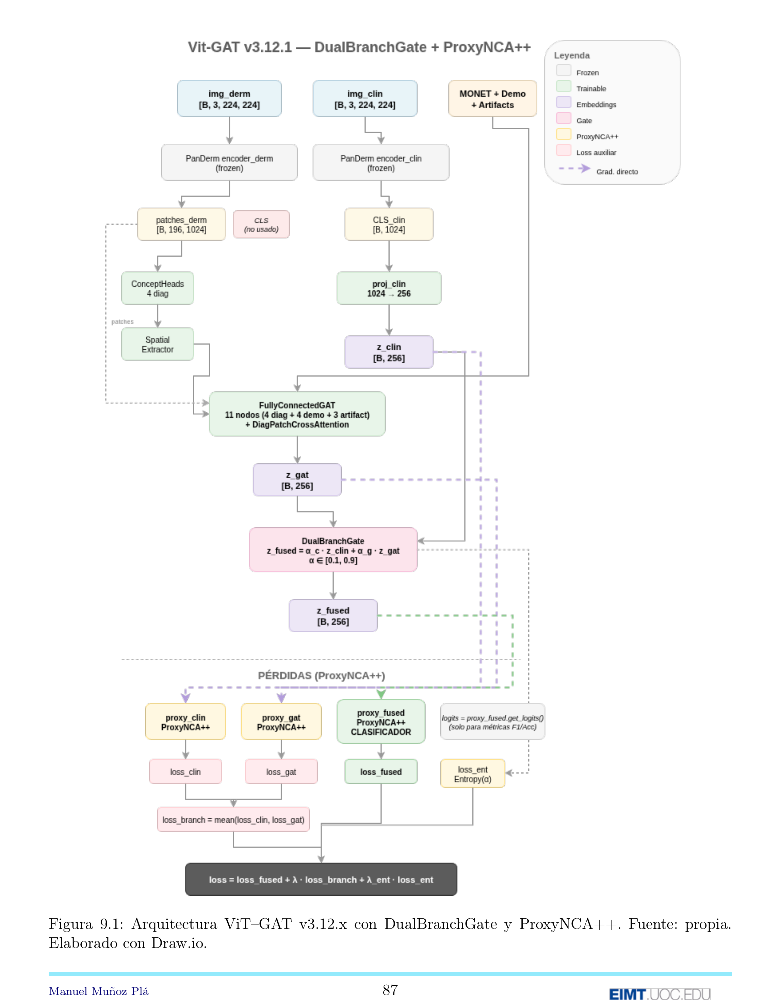

# Pipeline v3.12.x — ViT-GAT 11 + DualBranchGate + 3× ProxyNCA++

**Clasificación multimodal de lesiones cutáneas con Graph Attention Networks y Metric Learning.**

Sistema híbrido que combina la potencia de los Vision Transformers (PanDerm) con el razonamiento estructurado de las Graph Attention Networks, usando ProxyNCA++ puro como función de pérdida principal (sin Focal Loss). Optimizado para el dataset MILK10K con 11 clases de lesiones cutáneas y severo desbalance de clases.

---

## Resultados

### Métricas OOF (5-fold CV)

| Métrica | Valor |
|---------|-------|
| **F1 Macro** | **0.5276** |
| Balanced Accuracy | 0.5061 |
| AUC-ROC (macro) | 0.8578 |
| Accuracy | 0.7536 |
| MCC | 0.6483 |
| Cohen Kappa | 0.6464 |

### Leaderboard

| Config | TTA | T_SOFT | LB F1 |
|--------|-----|--------|-------|
| baseline | 1 | 1.0 | 0.377 |
| tta8_t010 | 8 | 0.10 | 0.381 |
| tta8_t025 | 8 | 0.25 | **0.382** |

---

## Arquitectura del Pipeline



---

## Estructura del Pipeline

El pipeline v3.12.x se organiza en **9 etapas** (0-8), cada una con responsabilidades específicas:

| Etapa | Nombre | Descripción |
|-------|--------|-------------|
| 0 | Configuración | Semillas, device, hiperparámetros v3.12.x |
| 1 | Preprocesamiento | Carga datos, emparejamiento multimodal, folds |
| 2 | Validación | Anti-leakage, verificación de integridad |
| 3a | Análisis EDA | Exploración demográficos + MONET |
| 3 | Dataset | Datasets con cache, dataloaders |
| 4 | MONET | Extracción de conceptos visuales |
| 5 | Modelo | DualBranchGate + 3× ProxyNCA++ |
| 6 | Training | Loop con ProxyNCA++ puro |
| 7 | Inferencia | TTA, submission multi-config |
| 8 | Métricas | Análisis OOF, gates, calibración |

---

## Etapa 0 — Configuración

**Propósito**: Inicialización del entorno, semillas para reproducibilidad, configuración de hiperparámetros y rutas del proyecto.

### Constantes principales

| Constante | Valor | Descripción |
|-----------|-------|-------------|
| `SEED` | 2025 | Semilla global |
| `DEVICE` | cuda/cpu | Dispositivo de cómputo |
| `N_CLASSES` | 11 | Clases MILK10K |
| `MILK10K_CLASSES` | list[str] | AKIEC, BCC, BEN_OTH, BKL, DF, INF, MAL_OTH, MEL, NV, SCCKA, VASC |
| `CLASS_TO_IDX` | dict | Mapeo clase → índice |
| `IDX_TO_CLASS` | dict | Mapeo índice → clase |

### Diccionario `CFG`

```python
CFG: dict = {

    # DATOS E IMÁGENES
    "FOLDS": 5,
    "IMG_SIZE": 224,
    "MEAN": (0.485, 0.456, 0.406),
    "STD": (0.229, 0.224, 0.225),

    # DATALOADER + CACHE
    "BATCH_SIZE": 256,
    "MONET_BATCH_SIZE": 64,
    "USE_IMAGE_CACHE": True,
    "PRELOAD_ALL_FOLDS": True,
    "CACHE_NUM_THREADS": 32,
    "PIN_MEMORY": True,

    # OVERSAMPLING
    "USE_OVERSAMPLING": True,
    "MIN_SAMPLES_PER_CLASS": 2000,

    # AUGMENTATION
    "USE_MIXUP": True,
    "MIXUP_ALPHA": 0.4,
    "CUTMIX_ALPHA": 0.8,
    "MIXUP_PROB": 0.5,

    # REGULARIZACIÓN
    "DROPOUT_HEAD": 0.7,
    "DROPOUT_GAT": 0.6,
    "LABEL_SMOOTHING": 0.18,
    "WEIGHT_DECAY": 0.05,

    # TRAINING
    "EPOCHS": 40,
    "PATIENCE": 10,
    "MIN_EPOCHS": 10,
    "USE_AMP": True,
    "GRAD_CLIP": 0.5,

    # LEARNING RATES
    "LR_ENCODER": 2e-5,
    "LR_HEAD": 5e-4,
    "LR_GAT": 5e-4,
    "LR_MULTIPLIER": 5,

    # LOSS
    "FOCAL_GAMMA": 1.5,
    "LAMBDA_ENTROPY": 0.01,

    # PROXYNCA++ (v3.12.3)
    "USE_PROXYNCA": True,
    "LAMBDA_PROXYNCA": 0.3,
    "PROXYNCA_SCALE": 8.0,
    "PROXYNCA_MARGIN": 0.2,

    # DUALBRANCHGATE FASES
    "WARMUP_EPOCHS": 10,
    "TRANSITION_EPOCHS": 0,
    "MIN_GATE_ALPHA": 0.10,
    "MAX_GATE_ALPHA": 0.90,
    "LR_LIBRE_FACTOR": 0.5,

    # UNFREEZE SCHEDULE
    "USE_UNFREEZE": True,
    "UNFREEZE_SCHEDULE": {1: 0, 12: 1, 18: 2},

    # GAT 11 NODOS
    "GAT_NODES": 11,
    "N_DIAG_NODES": 4,
    "N_DEMO_NODES": 4,
    "N_ARTIFACT_NODES": 3,
    "GAT_HIDDEN": 128,
    "GAT_OUT": 256,
    "GAT_HEADS": 4,
    "GAT_LAYERS": 2,

    # SCHEDULER ADAPTATIVO
    "USE_PLATEAU_SCHEDULER": True,
    "PLATEAU_FACTOR": 0.5,
    "PLATEAU_PATIENCE": 3,

    # INFERENCE
    "TTA": 8,
    "T_SOFT": 0.25,
}
```

### Diccionario `PATHS`

```python
PROJECT_DIR: Path = Path.home() / "Documentos" / "3.12"

PATHS: dict[str, str] = {
    "META": str(PROJECT_DIR / "data" / "MILK10k_Training_Metadata.csv"),
    "GT": str(PROJECT_DIR / "data" / "MILK10k_Training_GroundTruth.csv"),
    "SUPPL": str(PROJECT_DIR / "data" / "MILK10k_Training_Supplement.csv"),
    "TEST_META": str(PROJECT_DIR / "data" / "MILK10k_Test_Metadata.csv"),
    "TRAIN_DIR": str(PROJECT_DIR / "MILK10k_Training_Input"),
    "TEST_DIR": str(PROJECT_DIR / "MILK10k_Test_Input"),
    "PANDERM_CKPT": str(PROJECT_DIR / "data" / "checkpoints" 
                       / "panderm_ll_data6_checkpoint-499.pth"),
    "OUT_DIR": str(PROJECT_DIR / "outputs"),
    "CKPT_DIR": str(PROJECT_DIR / "outputs" / "checkpoints"),
    "SUBMIT": str(PROJECT_DIR / "outputs" / "submit"),
}
```

### Constante `AUG_SUFFIXES`

```python
AUG_SUFFIXES: tuple[str, ...] = (
    "_r90", "_r180", "_r270",
    "_hflip", "_vflip", "_hvflip",
    "_r90_hflip", "_r90_vflip",
    "_r180_hflip", "_r180_vflip",
    "_r270_hflip", "_r270_vflip",
)
```

### Funciones

| Función | Descripción |
|---------|-------------|
| `seed_everything(seed)` | Fija semillas en random, numpy, torch, cudnn |
| `get_system_info()` | Obtiene información del sistema |
| `get_library_versions()` | Obtiene versiones de librerías |

---

## Etapa 1 — Preprocesamiento Multimodal

**Propósito**: Carga y preprocesamiento de datos MILK10K, emparejamiento de imágenes dermoscópicas y clínicas por lesión, asignación de folds estratificados.

### Constantes

| Constante | Valor | Descripción |
|-----------|-------|-------------|
| `LESION_COL` | "lesion_id" | Columna de identificación |
| `MALIGNANT_CLASSES` | tuple | MEL, BCC, SCCKA, AKIEC, MAL_OTH |

### Funciones

| Función | Descripción |
|---------|-------------|
| `parse_modality(image_type)` | Clasifica imagen como "derm" o "clin" |
| `index_images_parallel(base_dir)` | Indexa imágenes en paralelo |
| `resolve_path(isic_id, index)` | Resuelve ruta completa de una imagen |

### Variables de salida

| Variable | Tipo | Descripción |
|----------|------|-------------|
| `master_base` | pd.DataFrame | DataFrame maestro con todas las lesiones |
| `lesion_to_derm_path_base` | dict | Mapeo lesion_id → ruta derm |
| `lesion_to_clin_path_base` | dict | Mapeo lesion_id → ruta clin |
| `isic_to_meta` | dict | Mapeo isic_id → metadata |
| `isic_to_monet` | dict | Mapeo isic_id → scores MONET |

---

## Etapa 2 — Validación y Anti-Leakage

**Propósito**: Verificación de integridad de datos y prevención de data leakage entre folds de entrenamiento y validación.

### Funciones

| Función | Descripción |
|---------|-------------|
| `check_contract(name, condition, detail)` | Verifica condición con mensaje |
| `check_leakage_folds(df)` | Detecta lesiones en múltiples folds |
| `check_modality_pairs(df)` | Verifica pares derm+clin completos |
| `check_path_integrity(df)` | Verifica existencia de archivos |

### Validaciones realizadas

- Lesiones no duplicadas entre folds
- Cada lesión tiene exactamente 1 derm + 1 clin
- Todas las rutas de imágenes existen
- Distribución de clases consistente por fold
- Sin NaN en columnas críticas

---

## Etapa 3a — Análisis Exploratorio (EDA)

**Propósito**: Análisis exploratorio de variables demográficas y conceptos MONET para entender la distribución de datos.

### Variables analizadas

| Variable | Encoding | Rango |
|----------|----------|-------|
| `age_approx` | valor/100 | [0.05, 0.85] |
| `sex` | female=0.1, male=0.9 | [0.1, 0.9] |
| `site` | exposición UV | [0.10, 0.90] |
| `skin_tone_class` | tipo/6 | [0.17, 1.00] |

### Conceptos MONET

| Tipo | Conceptos | Dimensión |
|------|-----------|-----------|
| Diagnósticos | ulceration, vasculature, erythema, pigmented | [4] |
| Artefactos | hair, gel, skin_markings | [3] |

---

## Etapa 3 — Dataset Multimodal con Cache

**Propósito**: Implementación de datasets PyTorch con sistema de cache en memoria para acelerar el entrenamiento.

### Funciones de normalización

| Función | Descripción |
|---------|-------------|
| `_norm_sex(x)` | Normaliza sexo a [0.1, 0.9] |
| `_norm_age(x)` | Normaliza edad a [0.05, 0.85] |
| `_norm_site(x)` | Normaliza sitio anatómico por UV |
| `_norm_skin_tone(x)` | Normaliza fototipo a [0.17, 1.0] |

### Funciones de features

| Función | Descripción |
|---------|-------------|
| `get_diagnostic_scores(isic_id)` | Obtiene scores MONET diagnósticos [4-d] |
| `get_demographic_features(isic_id)` | Obtiene features demográficos [4-d] |
| `get_artifact_scores(isic_id)` | Obtiene scores de artefactos [3-d] |

### Clases

| Clase | Descripción |
|-------|-------------|
| `ImageCache` | Cache de imágenes preprocesadas en memoria |
| `LesionSample` | Dataclass con información de una lesión |
| `MILK10KDataset` | Dataset principal con cache + augmentation |

### Formato de batch

```python
batch = (
    img_derm,        # [B, 3, 224, 224]
    img_clin,        # [B, 3, 224, 224]
    has_clin,        # [B] float (0.0 o 1.0)
    monet_diag,      # [B, 4]
    demographic,     # [B, 4]
    artifact_scores, # [B, 3]
    y,               # [B] long
    lesion_ids,      # tuple[str]
    isic_derm,       # tuple[str]
    isic_clin,       # tuple[str]
)
```

---

## Etapa 4 — Extracción MONET

**Propósito**: Preparación de conceptos visuales MONET desde CSV precalculado.

### Conceptos MONET disponibles

| Columna CSV | Tipo | Descripción |
|-------------|------|-------------|
| `MONET_ulceration_crust` | Diagnóstico | Ulceración/costras |
| `MONET_vasculature_vessels` | Diagnóstico | Vascularización |
| `MONET_erythema` | Diagnóstico | Eritema/enrojecimiento |
| `MONET_pigmented` | Diagnóstico | Pigmentación |
| `MONET_hair` | Artefacto | Presencia de pelo |
| `MONET_gel_water_drop_fluid` | Artefacto | Gel/líquido |
| `MONET_skin_markings_pen_ink` | Artefacto | Marcas de piel/tinta |

### Funciones

| Función | Descripción |
|---------|-------------|
| `load_monet_from_csv()` | Carga scores MONET desde metadata |
| `build_isic_to_monet(df)` | Construye diccionario isic → scores |

---

## Etapa 5 — Modelo DualBranchGate + 3× ProxyNCA++

**Propósito**: Definición de la arquitectura completa del modelo híbrido ViT-GAT con ProxyNCA++.

### Constantes del modelo

| Constante | Valor | Descripción |
|-----------|-------|-------------|
| `ENCODER_DIM` | 1024 | Dimensión del encoder PanDerm |
| `N_PATCHES` | 196 | Patches por imagen (14×14) |
| `PATCH_GRID` | 14 | Grid de patches |
| `N_DIAG_NODES` | 4 | Nodos diagnósticos |
| `N_DEMO_NODES` | 4 | Nodos demográficos |
| `N_ARTIFACT_NODES` | 3 | Nodos de artefactos |
| `N_GAT_NODES` | 11 | Total nodos GAT |
| `GAT_HIDDEN` | 128 | Dimensión oculta GAT |
| `GAT_OUT` | 256 | Dimensión salida GAT |

### Clases del modelo

| Clase | Descripción |
|-------|-------------|
| `PanDermEncoderFull` | Encoder PanDerm que extrae CLS + patches |
| `BranchProjector` | Proyección 1024 → 256 para z_clin |
| `DiagnosticConceptHeads` | 4 heads sobre patches para conceptos diagnósticos |
| `SpatialFeatureExtractor` | Extrae [score, cx, cy, spread, max] por concepto |
| `DiagPatchCrossAttention` | Cross-attention entre nodos diag y patches |
| `GATLayer` | Capa de Graph Attention |
| `FullyConnectedGAT` | GAT 11 nodos fully connected |
| `DualBranchGate` | Gate 2 vías (clin + gat) |
| `ProxyNCAPlusPlus` | Metric learning con proxies aprendibles |
| `MultimodalGATClassifier` | Modelo completo v3.12 |

### DualBranchGate

```python
class DualBranchGate(nn.Module):
    """
    Gate de 2 vías para fusionar z_clin y z_gat.
    
    Entrada del gate:
        - z_clin: [B, 256]
        - z_gat: [B, 256]
        - diff = z_clin - z_gat: [B, 256]
        - demographic: [B, 4]
        - has_clin: [B, 1]
    
    Modos:
        - WARMUP (ep 1-10): α_c = 0.50, α_g = 0.50 (fijo)
        - LIBRE (ep 11+): α aprendido, clamp a [0.1, 0.9]
    
    Salida:
        - z_fused = α_c · z_clin + α_g · z_gat
        - alpha_dual: [B, 2] con α_c + α_g = 1
    """
```

### ProxyNCAPlusPlus (3 instancias)

```python
class ProxyNCAPlusPlus(nn.Module):
    """
    Metric learning con proxies aprendibles.
    
    Cada clase tiene un proxy [256-d] que sirve como representante ideal.
    
    Métodos:
        - forward(embeddings, labels): calcula pérdida contrastiva ProxyNCA++
        - get_logits(embeddings): similaridad coseno × scale (para métricas)
    
    Parámetros:
        - scale: 8.0
        - margin: 0.2
    """

# Instancias globales (3 instancias)
proxy_clin = ProxyNCAPlusPlus(in_dim=256, n_classes=11, name="clin")
proxy_gat = ProxyNCAPlusPlus(in_dim=256, n_classes=11, name="gat")
proxy_fused = ProxyNCAPlusPlus(in_dim=256, n_classes=11, name="fused")
```

### Forward del modelo

```python
def forward(self, batch):
    img_derm, img_clin, has_clin, monet_diag, demographic, artifact_scores, y, *_ = batch
    
    # 1. Encoder derm: solo patches
    _, patches_derm = self.encoder_derm(img_derm)  # [B, 196, 1024]
    
    # 2. Encoder clin: CLS → proj → z_clin
    cls_clin, _ = self.encoder_clin(img_clin)      # [B, 1024]
    z_clin = self.proj_clin(cls_clin)              # [B, 256]
    
    # 3. Spatial branch: patches → concepts → spatial features
    concept_maps = self.concept_heads(patches_derm)       # [B, 4, 14, 14]
    spatial_features = self.spatial_extractor(concept_maps)  # [B, 4, 5]
    
    # 4. GAT 11 nodos → z_gat
    z_gat = self.gat(
        monet_diag,        # [B, 4]
        spatial_features,  # [B, 4, 5]
        demographic,       # [B, 4]
        artifact_scores,   # [B, 3]
        patches=patches_derm  # para cross-attention
    )  # [B, 256]
    
    # 5. DualBranchGate: z_clin + z_gat → z_fused
    z_fused, alpha_dual = self.dual_gate(
        z_clin, z_gat, demographic, has_clin.unsqueeze(-1), phase=self.phase
    )
    
    # 6. Normalizar z_fused antes de ProxyNCA++
    z_fused = self.pre_proxy(z_fused)
    
    return {
        "alpha_dual": alpha_dual,  # [B, 2]
        "z_clin": z_clin,          # [B, 256] para ProxyNCA++ clin
        "z_gat": z_gat,            # [B, 256] para ProxyNCA++ gat
        "z_fused": z_fused,        # [B, 256] para ProxyNCA++ fused
    }
```

### Función de creación

| Función | Descripción |
|---------|-------------|
| `create_model(checkpoint_path)` | Crea instancia del modelo con pesos PanDerm |

---

## Etapa 6 — Training Loop

**Propósito**: Implementación del loop de entrenamiento con ProxyNCA++ puro (sin Focal Loss), fases warmup/libre, y tracking de métricas.

### Pérdidas (v3.12.1: ProxyNCA++ PURO)

```python
# En train_epoch():
with autocast():
    out = model(batch)
    z_clin = out["z_clin"]
    z_gat = out["z_gat"]
    z_fused = out["z_fused"]
    alpha_dual = out["alpha_dual"]
    
    # v3.12.1: ProxyNCA++ PURO (sin Focal Loss)
    # logits para métricas (NO para loss)
    logits = proxy_fused.get_logits(z_fused)
    
    # PÉRDIDA PRINCIPAL: ProxyNCA++ sobre z_fused
    loss_fused = proxy_fused(z_fused, y)
    
    # REGULARIZACIÓN: entropy sobre gate
    loss_ent = entropy_loss(alpha_dual)
    
    # GRADIENTES DIRECTOS a ramas (sin mixup)
    loss_clin = proxy_clin(z_clin, y)
    loss_gat = proxy_gat(z_gat, y)
    loss_branch = (loss_clin + loss_gat) / 2.0
    
    # LOSS TOTAL
    loss = loss_fused + loss_branch * lambda_proxynca + loss_ent * lambda_ent
```

### Clases de tracking

| Clase | Descripción |
|-------|-------------|
| `DualAlphaTracker` | Tracking de α_clin, α_gat (media por época) |
| `GATRatioTracker` | Ratio de normas ‖z_gat‖ / ‖z_clin‖ |
| `GradientTracker` | Monitoring de gradientes por componente |

### Funciones de training

| Función | Descripción |
|---------|-------------|
| `entropy_loss(alpha)` | -sum(α · log(α)) para regularizar gate |
| `mixup_data(x, y, alpha)` | Aplica MixUp augmentation |
| `cutmix_data(x, y, alpha)` | Aplica CutMix augmentation |
| `make_optimizer(model, lr_heads, lr_enc)` | Crea AdamW con param groups |
| `make_scheduler(optimizer, epochs, steps)` | Crea ReduceLROnPlateau |
| `train_epoch(...)` | Un epoch de entrenamiento |
| `val_epoch(...)` | Un epoch de validación |
| `train_fold(fold)` | Entrenamiento completo de un fold |

### Fases de entrenamiento

| Fase | Épocas | Gate | Encoder | Descripción |
|------|--------|------|---------|-------------|
| WARMUP | 1-10 | 50/50 fijo | Frozen | Gate no aprende, ramas se equilibran |
| LIBRE | 11+ | α aprendido | Unfreeze | Gate aprende, fine-tuning encoder |

### Unfreeze schedule

| Época | Bloques | Descripción |
|-------|---------|-------------|
| 1-11 | 0 | Encoder completamente frozen |
| 12-17 | 1 | 1 último bloque trainable |
| 18+ | 2 | 2 últimos bloques trainable |

### Prints de monitoreo

```
  ep 18 | loss=1.1913 | F1_tr=0.911 | F1_va=0.525 | BAcc=0.489 | gap=+0.387 | best=0.525 | 249s [*]
         DualGate [LIBRE] tr: c=0.30 g=0.70 | va: c=0.30 g=0.70
         ProxyNCA++ [3×] λ=0.3 | LR=2.00e-05 | blk=2/24 | pat=0/10
```

---

## Etapa 7 — Inferencia y Submission

**Propósito**: Generación de predicciones con TTA (Test Time Augmentation), creación de submission multi-config para Leaderboard.

### Configuraciones de submission

| Config | TTA | T_SOFT | Descripción |
|--------|-----|--------|-------------|
| baseline | 1 | 1.0 | Sin TTA ni temperature scaling |
| tta8_t010 | 8 | 0.10 | TTA estándar, temperature agresiva |
| tta8_t025 | 8 | 0.25 | TTA estándar, temperature suave |

### Formato de submission (Leaderboard)

```csv
lesion_id,AKIEC,BCC,BEN_OTH,BKL,DF,INF,MAL_OTH,MEL,NV,SCCKA,VASC
IL_0000001,0.05,0.60,...
```

### Validaciones del submission

```python
# 1. Columnas correctas
expected_cols = ["lesion_id"] + list(MILK10K_CLASSES)
assert list(sub_df.columns) == expected_cols

# 2. lesion_id válido
assert sub_df["lesion_id"].str.startswith("IL_").all()

# 3. Probabilidades válidas [0, 1]
# 4. Suma = 1 por fila
```

### Clases

| Clase | Descripción |
|-------|-------------|
| `TestDatasetV312` | Dataset para imágenes de test |

### Funciones

| Función | Descripción |
|---------|-------------|
| `get_tta_transforms(n_tta)` | Genera transformaciones TTA |
| `load_models(n_folds)` | Carga modelos de todos los folds |
| `run_inference(tta_n, t_soft)` | Ejecuta inferencia con config específica |
| `create_submission_df(preds)` | Genera DataFrame de submission |
| `validate_submission(sub_df)` | Verifica formato del submission |

---

## Etapa 8 — Métricas y Diagnóstico

**Propósito**: Análisis completo de predicciones OOF, diagnóstico de gates, calibración y visualizaciones.

### Métricas globales

| Categoría | Métrica | Valor |
|-----------|---------|-------|
| Accuracy | Accuracy | 0.7536 |
| | Balanced Accuracy | 0.5061 |
| | Top-2 Accuracy | 0.8786 |
| | Top-3 Accuracy | 0.9349 |
| | Top-5 Accuracy | 0.9725 |
| F1-Score | F1 Macro | 0.5276 |
| | F1 Weighted | 0.7435 |
| | F1 Micro | 0.7536 |
| Prec/Rec | Precision (macro) | 0.5566 |
| | Recall (macro) | 0.5061 |
| Robustez | Cohen Kappa | 0.6464 |
| | MCC | 0.6483 |
| AUC | AUC-ROC (macro) | 0.8578 |
| | AUC-ROC (weighted) | 0.9173 |

### Diagnóstico de Gates

| Componente | Media | Interpretación |
|------------|-------|----------------|
| alpha_clin | ~0.30 | Rama clínica aporta 30% |
| alpha_gat | ~0.70 | Rama GAT aporta 70% |

Interpretación: La rama GAT (α≈0.70) aporta mayor poder discriminativo que la rama clínica (α≈0.30).

### Sensibilidad por tipo

| Tipo | Sensibilidad |
|------|-------------|
| Malignas | 0.5174 |
| Benignas | 0.4966 |
| Clínica | 0.9159 |

### Archivos generados

```
outputs/model_output/
├── metrics_v312.json
├── class_metrics_v312.csv
├── confusion_matrix_v312.png
├── roc_pr_det_curves_v312.png
├── calibration_v312.png
└── gates_diagnosis_v312.png
```

---

## Dependencias

```
torch>=2.0
torchvision
timm
numpy
pandas
scikit-learn
rich
tqdm
Pillow
albumentations
```

---

## Referencias

- **PanDerm**: Pre-trained ViT-L para dermatología
- **MONET**: Medical Open Network for Explainable Features
- **ProxyNCA++**: "Revisiting and Revitalizing Proxy Neighborhood Component Analysis" (ECCV 2020)

---

## Notas técnicas

- **DualBranchGate**: Gate de 2 vías que fusiona z_clin y z_gat. En fase LIBRE, el gate aprende que z_gat (α≈0.70) es más informativo que z_clin (α≈0.30).

- **ProxyNCA++ PURO (v3.12.1)**: Sin Focal Loss. La pérdida principal es ProxyNCA++ sobre z_fused, con pérdidas auxiliares sobre z_clin y z_gat para gradientes directos a las ramas.

- **λ=0.3**: Las ramas z_clin y z_gat reciben 30% del gradiente de la pérdida auxiliar.

- **Unfreeze conservador**: 1 bloque desde época 12, 2 bloques desde época 18. Permite fine-tuning gradual del encoder sin sobreajuste.

- **ReduceLROnPlateau**: Scheduler adaptativo que reduce LR ×0.5 si F1_va no mejora en 3 épocas.

---
